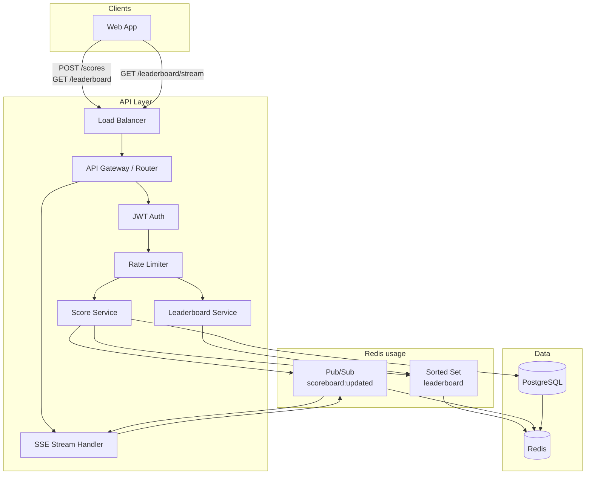
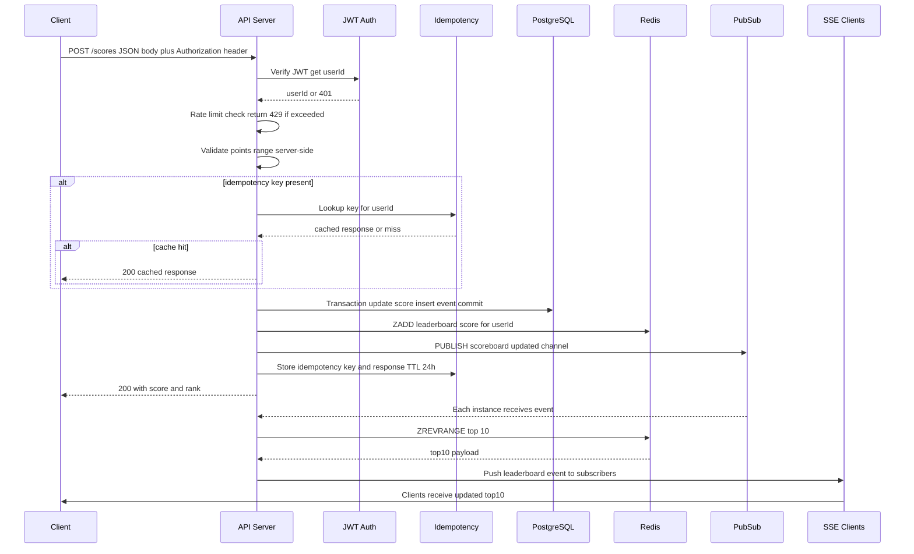

# Real-Time Leaderboard API — Backend Module Specification

**Version:** 1.0  
**Audience:** Backend engineering team  
**Status:** Production-ready specification

---

## 1. Overview

### 1.1 Purpose

This module implements the backend for a **real-time leaderboard**: a scoreboard showing the top 10 users by score. Users perform actions (e.g. game events, challenges); completing an action increases their score. The client calls the API to record the score update; connected clients receive live leaderboard updates without polling.

**Goals:**

- Expose a **score-update API** (`POST /scores`) and **leaderboard API** (`GET /leaderboard`).
- Push **real-time** leaderboard updates to clients when scores change.
- **Prevent cheating**: only authenticated users can update their own score; server validates all inputs and applies rate limits and idempotency.
- Design for **scalability** and production (stateless API, Redis, optional message queue).

### 1.2 Scope

| In scope | Out of scope |
|----------|--------------|
| Score update API (auth, validation, idempotency) | Definition or logic of “actions” (game rules, etc.) |
| Leaderboard read API (top 10, current user rank) | Frontend UI |
| Real-time push channel (SSE recommended) | User registration / login (assume existing auth) |
| Persistence: DB (scores, users, idempotency) + Redis (leaderboard, pub/sub) | Payment or rewards |
| Security: JWT, rate limiting, server-side validation, anti-cheat basics | Fraud ML models (noted as future work) |

---

## 2. Architecture Design

### 2.1 High-Level Architecture

```
                    ┌─────────────────────────────────────────────────────────┐
                    │                      CLIENTS                              │
                    │  (Browser / App — scoreboard UI, action completion)      │
                    └───────────────────────────┬─────────────────────────────┘
                                                 │
                         HTTPS (REST)            │            SSE (real-time)
                         POST /scores            │            GET /leaderboard/stream
                         GET /leaderboard        │
                                                 ▼
                    ┌─────────────────────────────────────────────────────────┐
                    │              API SERVICE (Stateless)                     │
                    │  Auth (JWT) │ Rate limit │ Validation │ Score service   │
                    └──────┬──────────────────────────────────┬───────────────┘
                           │                                  │
           ┌───────────────┼───────────────┐     ┌───────────┴───────────┐
           ▼               ▼               ▼     ▼                       ▼
    ┌─────────────┐ ┌─────────────┐ ┌─────────────┐              ┌─────────────┐
    │  PostgreSQL │ │    Redis    │ │ Redis       │              │ Redis       │
    │  (scores,  │ │  Sorted Set │ │ Pub/Sub     │              │ (optional   │
    │   users,   │ │  leaderboard│ │ (broadcast  │              │  cache)     │
    │   actions) │ │             │ │  updates)   │              │             │
    └─────────────┘ └─────────────┘ └─────────────┘              └─────────────┘
```

### 2.2 Components and Rationale

| Component | Role | Why |
|-----------|------|-----|
| **API service** | Stateless HTTP server: auth, validation, score update, leaderboard read, SSE stream. | Single entry point; scales horizontally behind a load balancer. |
| **PostgreSQL** | Source of truth: users, scores (per user), score_events/actions, idempotency keys. | Durable, ACID; supports audits and analytics. |
| **Redis Sorted Set** | Leaderboard: key = `leaderboard:global`, member = userId, score = total score. | O(log N) update, O(log N + K) top-K; sub-millisecond reads. |
| **Redis Pub/Sub** | Broadcast “leaderboard updated” so all API instances push to their SSE clients. | Decouples writers from subscribers; works with multiple API replicas. |
| **SSE (Server-Sent Events)** | One-way stream: server → client with new top 10 when data changes. | Simpler than WebSocket for “server pushes updates”; auto-reconnect; works through most proxies. |
| **Optional: message queue (Kafka/RabbitMQ)** | Async score processing at very high throughput; durable event log. | Use when write volume or downstream consumers justify it; not required for MVP. |

### 2.3 Architecture Diagram (Mermaid)



---

## 3. Execution Flow

### 3.1 End-to-End Flow: User Completes Action → Score Update → Real-Time Push

**Steps (critical path):**

1. **Client:** User completes an action in the app. Client sends `POST /scores` with JWT and body `{ "points": 10, "actionId": "...", "idempotencyKey": "..." }`.  
   **Critical:** Never send `userId` in body; identity comes only from JWT.

2. **API — Auth:** Validate JWT; extract `userId` (subject). If invalid/missing → `401`.  
   **Critical:** Reject before any DB/Redis access.

3. **API — Rate limit:** Check per-user (and optionally per-IP) limit for `POST /scores`. If exceeded → `429`.

4. **API — Validation:**  
   - `points`: integer, in range [1, MAX_POINTS_PER_REQUEST] (configurable).  
   - `idempotencyKey`: optional but recommended; if present, format check (e.g. UUID).  
   **Critical:** Do not trust client for bounds; enforce server-side.

5. **API — Idempotency:** If `idempotencyKey` provided, look up in DB (or Redis). If key exists for this user → return stored response (200 + same payload), no write. **Critical:** Prevents double-credit on retries.

6. **API — Atomic score update:**  
   - **DB:** Insert or append to score/event store; update user’s total score (transaction).  
   - **Redis:** `ZADD leaderboard:global {newScore} {userId}` (atomic).  
   **Critical:** Use a single transaction or two-phase flow so DB and Redis stay consistent; on failure, rollback or compensate.

7. **API — Publish:** `PUBLISH scoreboard:updated 1` (or minimal payload). All API instances subscribed to this channel will push to their SSE clients.

8. **API — Idempotency store:** If new request, store `idempotencyKey` → response (and maybe userId, points, timestamp) with TTL (e.g. 24h).

9. **API — Response:** `200 OK` with `{ "score": 150, "rank": 5 }` (and optionally current top 10 slice).

10. **SSE:** Each API instance that has SSE connections re-reads top 10 from Redis (or from local cache invalidated by pub/sub), then sends one event per connection: `data: {"top10":[...]}\n\n`.  
    **Critical:** Debounce/throttle (e.g. max one push per second per connection) to avoid thundering herd after bursts.

### 3.2 Sequence Diagram (Mermaid)



### 3.3 Critical Points Summary

| Point | What | Why |
|-------|------|-----|
| **Identity from JWT only** | `userId` is never taken from request body; only from verified JWT. | Prevents users from crediting points to another user. |
| **Atomic update** | DB and Redis updated in a defined order; use transaction for DB; consider dual-write with reconciliation if needed. | Avoids inconsistent leaderboard vs source of truth. |
| **Idempotency** | Same `idempotencyKey` + same user → same response, no double increment. | Handles client retries and duplicate submissions. |
| **Server-side validation** | points range, types, and limits enforced on server. | Client can be manipulated; server is authority. |
| **Throttled push** | SSE push debounced per connection. | Prevents storm of messages on burst updates. |

---

## 4. API Specification

### 4.1 POST /scores

Records a score increment for the **authenticated user** (identity from JWT). Idempotent when `idempotencyKey` is used.

**Request**

- **Method:** `POST`
- **Path:** `/scores` (or `/api/v1/scores`)
- **Headers:**
  - `Authorization: Bearer <JWT>` (required)
  - `Content-Type: application/json`

**Body**

```json
{
  "points": 10,
  "actionId": "optional-action-identifier",
  "idempotencyKey": "optional-uuid-or-opaque-string"
}
```

| Field | Type | Required | Description |
|-------|------|----------|-------------|
| `points` | integer | Yes | Points to add. Must be in [1, MAX_POINTS_PER_REQUEST]. |
| `actionId` | string | No | Client action id for audit; not used for auth. |
| `idempotencyKey` | string | No | Client-generated key (e.g. UUID). Same key + same user → same response, no double add. TTL e.g. 24h. |

**Response — Success**

- **Status:** `200 OK`
- **Body:**

```json
{
  "score": 150,
  "rank": 5
}
```

Optional: include `top10` in response to avoid an extra GET.

**Error responses**

| Status | Meaning |
|--------|--------|
| `400 Bad Request` | Invalid body; `points` missing, not integer, or out of range. |
| `401 Unauthorized` | Missing or invalid JWT. |
| `403 Forbidden` | Reserved (e.g. if in future you allow server-to-server with different rules). |
| `409 Conflict` | Idempotency key already used with a *different* request body (optional strict mode). |
| `429 Too Many Requests` | Rate limit exceeded for this user or IP. |
| `500 Internal Server Error` | Server or DB/Redis error. |

**Idempotency**

- If `idempotencyKey` is sent and already stored for this user: return `200` with the **stored** response; do not apply points again.
- Key scope: per user (from JWT). TTL: e.g. 24 hours.
- Store: DB table or Redis. Key format: e.g. `idempotency:{userId}:{idempotencyKey}`.

---

### 4.2 GET /leaderboard

Returns the current top 10 and, optionally, the current user’s rank.

**Request**

- **Method:** `GET`
- **Path:** `/leaderboard` (or `/api/v1/leaderboard`)
- **Query:** `?include_rank=1` — if authenticated, include `myRank` in response.
- **Headers:** `Authorization: Bearer <JWT>` (optional; required for `include_rank`).

**Response — Success**

- **Status:** `200 OK`
- **Body:**

```json
{
  "top10": [
    { "userId": "u1", "displayName": "Alice", "score": 1000, "rank": 1 },
    { "userId": "u2", "displayName": "Bob", "score": 900, "rank": 2 }
  ],
  "myRank": { "userId": "u5", "displayName": "Eve", "score": 150, "rank": 5 }
}
```

`myRank` only present when `include_rank=1` and user is authenticated.

---

### 4.3 GET /leaderboard/stream (SSE)

Real-time stream of leaderboard updates. Clients subscribe; server sends an event when the leaderboard changes (after throttling).

**Request**

- **Method:** `GET`
- **Path:** `/leaderboard/stream`
- **Headers:** `Accept: text/event-stream`, `Authorization: Bearer <JWT>` (optional but recommended).

**Response**

- **Status:** `200 OK`
- **Headers:** `Content-Type: text/event-stream`, `Cache-Control: no-cache`, `Connection: keep-alive`
- **Body:** SSE stream, e.g.:

```
data: {"top10":[{"userId":"u1","displayName":"Alice","score":1000,"rank":1},...]}

```

Send only when top 10 actually changes (or at most once per second per connection) to avoid flooding.

---

## 5. Data Design

### 5.1 Database Schema (PostgreSQL)

**users** (assumed to exist; extend if needed)

- `id` (PK, UUID)
- `display_name`, `email`, etc.

**scores**

- `user_id` (PK, FK → users.id)
- `score` (BIGINT, ≥ 0) — current total
- `updated_at` (TIMESTAMPTZ)

**score_events** (audit / idempotency / analytics)

- `id` (PK)
- `user_id` (FK)
- `points` (INT)
- `action_id` (nullable, client-provided)
- `idempotency_key` (nullable, unique per user + key or global with user in index)
- `created_at` (TIMESTAMPTZ)

**idempotency** (optional dedicated table)

- `key` (e.g. `user_id + idempotency_key`, PK or unique)
- `user_id`, `response_body` (JSONB or similar), `created_at`
- TTL: delete or ignore after 24h.

### 5.2 Redis Usage

**Sorted Set: leaderboard**

- **Key:** `leaderboard:global` (or `leaderboard:{region}` for regional later).
- **Member:** `userId`
- **Score:** total score (numeric).
- **Commands:**  
  - Update: `ZADD leaderboard:global {newScore} {userId}` (each score update).  
  - Top 10: `ZREVRANGE leaderboard:global 0 9 WITHSCORES` (or get member details from DB/cache by userId).
- **Why Redis:** O(log N) add and O(log N + K) range query; sub-ms latency; ideal for a single global leaderboard. DB-only would require ORDER BY + LIMIT and more load under high read volume.

**Pub/Sub**

- **Channel:** `scoreboard:updated`
- **Publisher:** API after a successful score update.
- **Subscribers:** All API instances; each instance pushes to its own SSE connections when it receives the message.
- **Why Redis:** Multiple stateless API servers can share one broadcast channel without a shared in-memory state.

### 5.3 Why Redis for the Leaderboard

- **Performance:** Top-10 read and score update are O(log N) in the number of users; suitable for millions of members.
- **Single source for “current” rank:** One Sorted Set gives a consistent view for both GET /leaderboard and SSE push.
- **Pub/Sub:** Built-in, simple broadcast so every API replica can push to its SSE clients when data changes.
- **Persistence:** Can use RDB or AOF so leaderboard survives restarts; DB remains source of truth for scores and events.

---

## 6. Real-Time Strategy

### 6.1 WebSocket vs SSE vs Polling

| Criteria | WebSocket | SSE | Short polling |
|----------|------------|-----|----------------|
| Direction | Full duplex | Server → client | Client → server (repeated) |
| Complexity | Higher (protocol, reconnect, backpressure) | Lower (HTTP, EventSource API) | Lowest |
| Proxy / LB | Can need special handling | Standard HTTP | Standard HTTP |
| Reconnect | Manual | Built-in (EventSource) | N/A |
| Use case | Chat, games (bidirectional) | Notifications, feeds, leaderboard | Simple fallback |

### 6.2 Choice: SSE (Server-Sent Events)

**Reasons:**

- Leaderboard is **one-way**: server pushes new top 10; client does not send data over the same channel (score updates go via POST /scores).
- **Simpler** than WebSocket: one HTTP connection, standard headers, no custom frame protocol.
- **EventSource** in browsers handles reconnect and backoff.
- **Compatibility** with typical load balancers and proxies (long-lived HTTP).
- **Easier** to implement and debug (plain HTTP + chunked body).

**When to consider WebSocket instead:** If you later add real-time bidirectional features (e.g. live chat, game moves) on the same connection, or need binary frames.

**Polling:** Use only as fallback (e.g. clients that don’t support SSE or behind strict proxies); recommend interval ≥ 5s to limit load.

---

## 7. Security Design

### 7.1 JWT Authentication

- **POST /scores** and **GET /leaderboard** (with `include_rank`) require a valid JWT.
- **GET /leaderboard/stream** should require JWT (or at least rate limit by IP) to avoid anonymous abuse.
- **Identity:** `userId` is taken only from JWT `sub` (or agreed claim). Never use `userId` from request body for authorization.
- **Validation:** Verify signature, expiry (`exp`), and optionally issuer/audience. Reject expired or malformed tokens with `401`.

### 7.2 Rate Limiting

- **POST /scores:** Per-user limit (e.g. 60 req/min) and optionally per-IP (e.g. 120 req/min). Prevents scripted score inflation.
- **GET /leaderboard:** Per-IP or per-user (e.g. 120 req/min) to protect Redis and API.
- **GET /leaderboard/stream:** Limit concurrent SSE connections per user or per IP (e.g. 2 per user).
- Implementation: Redis sliding window or token bucket; store keys like `ratelimit:scores:{userId}`.

### 7.3 Duplicate Score Updates

- **Idempotency:** Require or encourage `idempotencyKey`; store key → response for (userId, key) with TTL. Same key → return stored response, no new points.
- **Idempotency key scope:** Per user (from JWT). Optionally reject if same key is sent with different `points` (409).

### 7.4 Server-Side Validation

- **points:** Type (integer), range [1, MAX_POINTS_PER_REQUEST]. Reject negative, zero, or over limit.
- **actionId / idempotencyKey:** Format and length limits to avoid abuse.
- **No trust in client:** Do not use client-supplied `userId` for scoring; do not trust client for “current score” or “new score” — always compute from DB/Redis.

### 7.5 Anti-Cheat Strategies

- **Cap per request:** MAX_POINTS_PER_REQUEST (e.g. 100) limits impact of a single forged request.
- **Rate limit:** Reduces burst cheating.
- **Audit log:** Store score_events (user_id, points, action_id, idempotency_key, created_at) for later analysis and rollback.
- **Anomaly detection (future):** Flag users with impossible point velocity or patterns; manual or automated review.

---

## 8. Edge Cases

| Edge case | Behavior | Implementation note |
|-----------|----------|----------------------|
| **Duplicate request (same idempotencyKey)** | Return same 200 and payload; do not add points again. | Lookup before write; store response on first success. |
| **Network retry (same key)** | Same as above; client can safely retry. | Idempotency key is mandatory or strongly recommended. |
| **Out-of-order delivery** | Process in order of server receipt. For same user, DB transaction order defines final score; Redis ZADD is last-write-wins per user. | Single writer per user (per request) or use DB as source of truth and periodically sync Redis from DB. |
| **Concurrent updates (same user)** | Two requests at once: both validated; DB serializes via transaction; Redis ZADD twice. Final score = sum of both increments. | Acceptable; if you need strict ordering, use a queue or serialise per user (e.g. Redis lock per userId). |
| **Concurrent updates (different users)** | No conflict; both get correct rank after both Redis updates. | ZADD is atomic; top 10 read after both updates sees consistent state. |
| **SSE client reconnects** | Client opens new stream; receives next broadcast. Optionally send current top 10 immediately on connect. | Send one event with current top 10 when connection opens. |
| **Redis/DB down** | POST /scores returns 503 or 500; do not credit points without persistence. | Fail fast; no partial write (no Redis update without DB, or vice versa depending on policy). |

---

## 9. Scalability & Performance

### 9.1 Horizontal Scaling

- **API:** Stateless; run N instances behind a load balancer. No in-memory session; JWT is self-contained. SSE connections are long-lived; LB should support sticky sessions or ensure SSE endpoint is not broken by connection migration (or use a single connection per client that never moves).
- **PostgreSQL:** Scale read replicas for GET-heavy workloads if needed; score updates go to primary. Use connection pooling (e.g. PgBouncer).
- **Redis:** Single instance or cluster. Sorted Set and Pub/Sub work on single-node; for very high write volume, consider sharding by key (e.g. multiple leaderboards by region).

### 9.2 Stateless Services

- No server-side session storage for score or leaderboard state. JWT + DB/Redis are the source of truth.
- SSE: Each API instance holds only its own connections; Redis Pub/Sub notifies all instances so they can push to their clients.

### 9.3 Caching

- **Leaderboard read:** Optionally cache top 10 in Redis with short TTL (e.g. 1–2 s) or skip cache and read from Sorted Set every time (already fast). Invalidate or overwrite on each score update if you cache.
- **User rank:** Can be computed from Redis ZREVRANK when needed; cache per user with short TTL if GET /leaderboard with `include_rank` is very hot.

### 9.4 Optional: Message Queue (Kafka / RabbitMQ)

- **When:** Very high write volume (e.g. millions of score events per hour) or need for durable event log and multiple consumers (analytics, fraud, notifications).
- **Flow:** API accepts POST /scores, validates and writes idempotency; publishes “score event” to queue; consumer updates DB and Redis and publishes to Redis Pub/Sub. Response to client can be 202 Accepted with event id, or synchronous (wait for consumer) depending on latency requirements.
- **Trade-off:** Adds operational complexity; not required for MVP or moderate traffic.

---

## 10. Trade-offs

| Decision | Choice | Alternative | Reason |
|----------|--------|-------------|--------|
| Real-time transport | SSE | WebSocket, polling | One-way updates; simpler ops and client code. |
| Leaderboard storage | Redis Sorted Set | DB ORDER BY + LIMIT | Latency and read load; Redis is built for this. |
| Idempotency storage | DB or Redis | In-memory per instance | Survives restarts; works across replicas. |
| Score update path | Synchronous (DB + Redis then respond) | Async via queue | Lower latency and simpler; queue when scale demands. |
| Identity | JWT only, no body userId | Body userId with checks | Simpler and safer: one source of truth. |
| Rate limit storage | Redis | In-memory, external | Redis shared across instances; consistent limits. |

---

## 11. Future Improvements

- **Fraud detection:** Model “normal” score velocity and distribution; flag or throttle outliers; manual review queue; optional rollback of suspicious events.
- **Regional leaderboards:** Separate Sorted Sets (e.g. `leaderboard:us`, `leaderboard:eu`); same API with `?region=us` or separate endpoints.
- **Time-window leaderboards:** Daily/weekly/all-time; additional keys or time-bounded aggregates in DB/Redis.
- **Analytics:** ETL from score_events to warehouse; dashboards for engagement, top actions, and abuse metrics.
- **WebSocket upgrade:** If product adds real-time bidirectional features, offer WebSocket alongside or instead of SSE for those flows.

---

## Appendix: Diagram Index

| Diagram | Section | Description |
|---------|---------|-------------|
| High-level architecture | 2.1 | ASCII: clients, API, PostgreSQL, Redis (Sorted Set + Pub/Sub). |
| Architecture (Mermaid) | 2.3 | Flowchart: LB, API, Auth, Rate limit, Score/Board/SSE, PG, Redis. |
| Execution sequence (Mermaid) | 3.2 | Sequence: POST /scores → Auth → validation → idempotency → DB + Redis → Pub/Sub → SSE push. |
